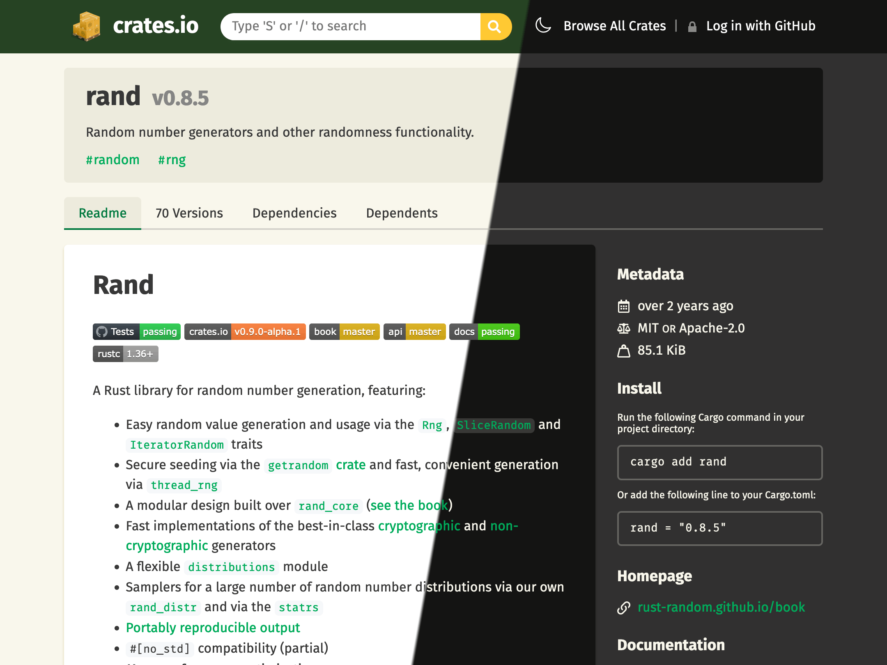
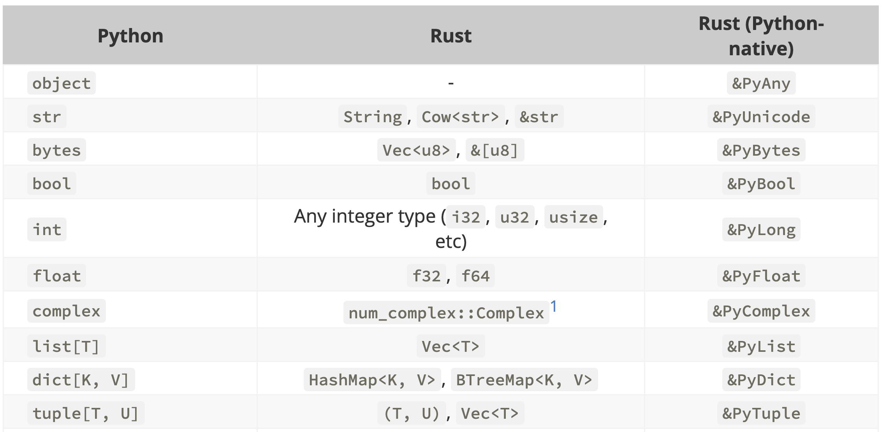

## Agenda

- Introduce  the tools
- Build an extension using PyO3
- Understand what problems Python extensions in Rust solve

## About me

- Maintainer of `rustworkx` (peaked at the Top 1% of PyPI packages)
- User of PyO3 since 2021
- Casually contributed features I needed to PyO3 upstream

## Why this presentation

Rust has taken over the Python ecosystem!

- Popular libraries like `pydantic` and `cryptography` use Rust
- Python tooling also uses Rust like:
    - Astral's uv
    - Microsoft's Python Environment Tools
    - Facebook's Pyrefly

But why? Hopefully you'll understand by the end.

## Tools we are going to be using

We don't assume you'll be familiar with all of them. Rust users will know Rust tools,
Python users will known Python tools. 

- PyO3
- Maturin
- pip
- PyPI
- Cargo
- Crates.io


## Motivating Problem

To give us a concrete goal, this presentation will build an extension that can decode
JPEG XL images.

As of 2025, iPhones can now take photos and save in the JPEG XL file format. It's feasible you'd find this file format in the wild!

## Maturin

Maturin is a Python build tool provided by the PyO3 developers. It helps building Rust code as extensions.

Maturin can be installed with `pip install maturin`.

The initial draft of the repository was the output of `maturin new`.

`maturin develop` installs the extension locally for development.

`maturin build` is used to package a wheel.

## Manifest files

These are the two files from `maturin new`, edited by me.

:::: {.columns}

::: {.column width="50%"}
### Cargo.toml

\tiny
```toml
[package]
name = "jxl_demo"
version = "0.1.0"
edition = "2021"

[lib]
name = "jxl_demo"
crate-type = ["cdylib"]

[dependencies]
ndarray = "0.16"
pyo3 = {
    version = "0.26.0", 
    features = [
        "abi3",
        "extension-module"
    ]
}
numpy = "0.26"
jxl-oxide = "0.11.4"
```
:::

::: {.column width="50%"}
### pyproject.toml

\tiny
```toml
[build-system]
requires = ["maturin>=1.9,<2.0"]
build-backend = "maturin"

[project]
name = "jxl_demo"
requires-python = ">=3.10"
classifiers = [
    # ommited
]
dynamic = ["version"]
dependencies = [
    "pillow>=10.0",
    "numpy>=2.0",
]

[tool.maturin]
features = ["pyo3/extension-module"]

```
:::

::::

## Dependencies

This demo is only possible thanks to `jxl-oxide` and `pyo3` being easily available on crates.io.

Rust arguably has more friendly dependency management than Python. We'll not discuss the Python packaging ecosystem.

:::: {.columns}

::: {.column width="50%"}




:::

::: {.column width="50%"}


:::

::::

## PyO3

:::: {.columns}

::: {.column width="60%"}

The glue between Python and Rust. PyO3 exposes:

* Python types to Rust e.g. `PyAny`
* Conversion between Rust and Python types
* Rust functions to Python via `#[pyfunction]`
* Rust structs to Python via `#[pyclass]`


:::

::: {.column width="40%"}




:::

::::

## PyO3 In Practice

Most of the work is to bridge the data between Python and Rust. Once that is settled, it becomes Rust code.


\tiny
```rust
#[pyfunction]
fn decode_jxl_as_array<'py>(
    py: Python<'py>,
    jxl_bytes: &Bound<'py, PyBytes>,
) -> PyResult<Bound<'py, PyArrayDyn<u8>>> {
    // Convert PyBytes to something Rust understands.
    let bytes = jxl_bytes.as_bytes();
    let cursor = std::io::Cursor::new(bytes);

    // Implementation details are hidden on purpose.
    let array = decode_jxl_core(cursor).map_err(|e| PyValueError::new_err(e))?;

    // Convert to a NumPy array and return.
    Ok(PyArrayDyn::from_array(py, &array))
}
```

## Modules

We need to export our functions and classes in modules. 

The good news: it is still much faster than regular Python imports.


\tiny
```rust
#[pymodule]
fn jxl_demo(m: &Bound<'_, PyModule>) -> PyResult<()> {
    m.add_function(wrap_pyfunction!(decode_jxl_as_array, m)?)?;
    m.add_function(wrap_pyfunction!(decode_jxl, m)?)?;
    Ok(())
}
```

## Elaborate workflows with Python

One thing we haven't explored yet is that PyO3 has access to the Python interpreter. We can interact with the Python objects.

PyO3 can go beyond just wrapping Rust code with input -> output.

To give a concrete example, let's write some that interacts with `PIL`. Our demo will bridge the Rust and Python ecosystems.

## Elaborate workflows in practice

\tiny

```rust
#[pyfunction]
fn decode_jxl<'py>(
    py: Python<'py>,
    jxl_bytes: &Bound<'py, PyBytes>,
) -> PyResult<Bound<'py, PyAny>> {
    // Import PIL.Image module
    let pil_image = py.import("PIL.Image")?;
    let fromarray_fn = pil_image.getattr("fromarray")?;

    // Get the NumPy array from our existing function
    let np_array = decode_jxl_as_array(py, jxl_bytes)?;

    let shape = np_array.shape();
    // Create Pillow Image from NumPy array
    let pil_img = if shape[2] == 3 || shape[2] == 4 {
        // a.k.a. RGB case
        fromarray_fn.call1((np_array,))?
    } else { /* omitted */};

    Ok(pil_img)
}
```